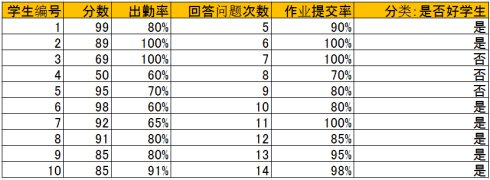
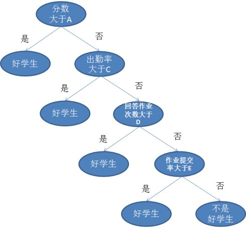
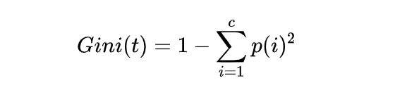

## CART分类回归树理解

## 介绍

cart是一种机器学习决策树算法，除CART外还有ID3、C4.5和C5.0。决策树是一个树形结构，每个内部节点代表一个属性的判断，每个分支代表判断的结果，每个叶子节点代表分类的结果。CART是一个二叉树结构。

### 背景（目标）

​	

### 应用场景（技术/业务）

决策树主要用来解决分类问题，需要监督学习。

### 优点缺点

### 组成部分及关键点

1.GINI指数：总体包含的类别越杂乱，GINI指数越大（类似熵），公式见下方。

2.为避免过度学习，对特别长的分支进行剪枝处理。

3.决策树训练时，一般采用Cross-Validation法。

### 底层原理（实现方式）

给出如下的一组数据，一共有十个样本（学生数量），每个样本有分数，出勤率，回答问题次数，作业提交率四个属性，最后判断这些学生是否是好学生。最后一列给出了人工分类结果。

然后用这一组附带分类结果的样本可以训练出多种多样的决策树，这里为了简化过程，我们假设决策树为二叉树，且类似于下图：

通过学习上表的数据，可以设置A，B，C，D，E的具体值，而A，B，C，D，E则称为阈值

所以决策树的生成主要有以下两个步骤，这两步通常通过学习已经知道分类结果的样本来实现:

1. 结点的分裂：当一个节点的属性无法给出分类判断时，将这一节点分成2个子节点（不是二叉树是会分裂成n个子节点）。
2. 阈值的设定：选择适当的阈值会使分类错误率最小。

- **基尼指数**：

c为类别数目

### 相同技术对比

